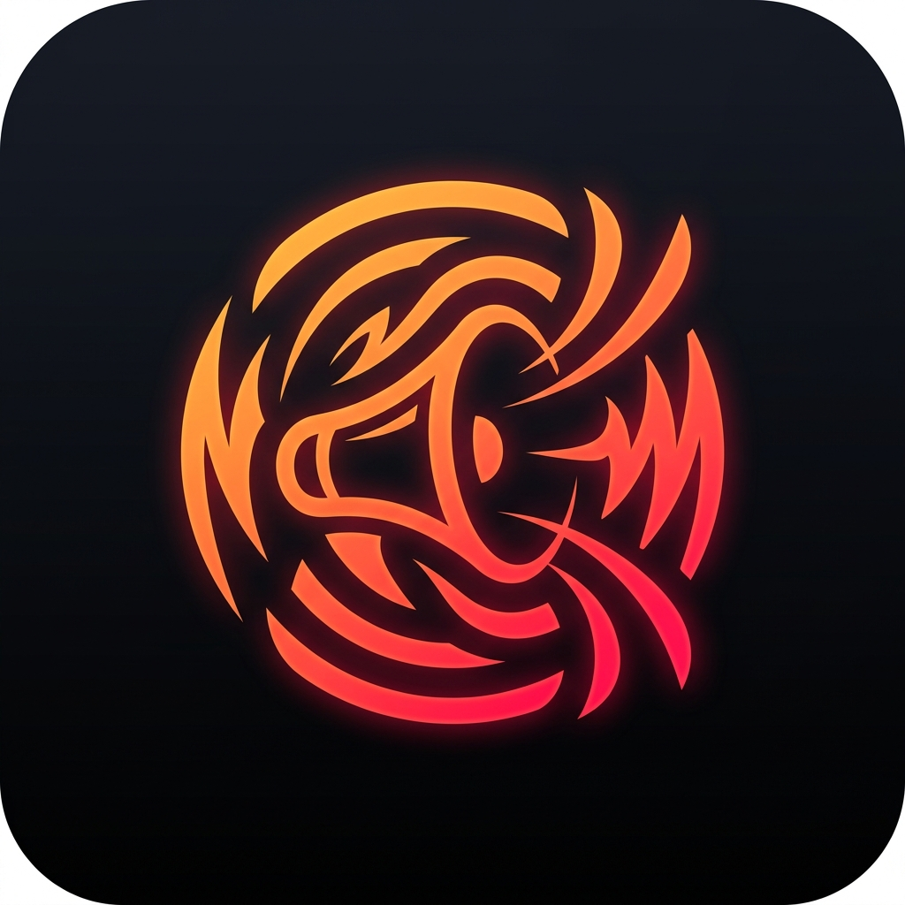
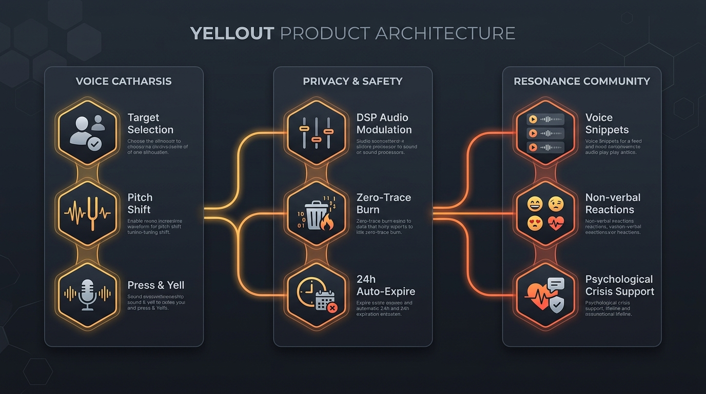

# 🗣️ YellOut / YellZone

> 一个面向中年群体的极简语音发泄与情绪避难所。选择发泄对象，按住直接咆哮，把压力彻底卸下。

[中文](./README.md) | [English](./README_EN.md)

  
  
<em>「声波破晓，咆哮释然」—— 声学脱敏 × 零社交负担 × 极致私密情绪出海口</em>

---

## 🎨 品牌设计与理念 (Brand & Visual Identity)

- **主品牌标（Logo）**：以破茧而出的**高能声波震荡**与**炽热情绪燃烬**为核心，打破成年人在车水马龙与家庭重压下的沉默与忍耐。
- **品牌调色板**：
  - 🟠 **燃烬橙 (Ember Orange · `#F97316`)**：情绪宣泄的爆发与重获新生。
  - ⚫ **暗夜黑 (Obsidian Dark · `#070B14`)**：深夜车库、私密独处的绝对安全底色。
  - 🟡 **温暖琥珀 (Warm Amber · `#F59E0B`)**：同温层的微光，无声的拥抱与支撑。
  - 🔘 **虚空灰 (Void Slate · `#1E293B`)**：匿名、无痕、焚毁后的释怀与归零。

---

## 📊 产品架构与功能流转图 (Product Architecture)

  

---

## 💡 项目背景与理念

中年人的压力往往来自于“不能倒下”的社会角色。在工作中不能发泄、在家里不能抱怨。
**YellOut** 旨在提供一个绝对安全、极简、无负担的情绪宣泄角落：
- **极简操作**：没有繁琐的社交功能，首页即发泄。
- **发泄对象**：精准选择倾倒对象（如：领导 / 伴侣 / 客户 / 生活 / 房贷 / 匿名）。
- **语音驱动**：长按直接说话/咆哮，系统自动变声脱敏，松开即投递。
- **纯粹回应**：广场仅保留语音鼓励与快捷同感按钮（如“抱抱”、“懂你”），杜绝文本说教与争议。

---

## 🛠️ 核心功能结构

1. **极简发泄舱（Venting Chamber）**
   - **发泄对象选择**：提供“领导 / 伴侣 / 客户 / 房贷 / 生活”等标签，支持自定义。
   - **按住发泄（Press & Yell）**：核心波纹大按钮，长按录音并实时变声（重低音炮 / 电音机甲 / 空灵虚空），松开自动发送。
   - **🔥 焚入虚空（Burn to Void）**：录音时长按上滑触发焚毁，配合燃烧声效与触感反馈，将委屈化为灰烬，不留任何痕迹。
   - **🌧️ 车窗夜雨沉浸底噪**：内置高拟真 Web Audio 粉红噪声雨声合成器，一键还原下班后独自坐在熄火汽车里的私密宁静。

2. **同温层广场（Resonance Square）**
   - **极简卡片展示**：仅显示发泄对象标签与变声短语音（限时 60 秒）。
   - **无负担交互**：支持非语言快捷按钮（抱抱 / 懂你 / 同感 / 拍肩）与短语音鼓励，杜绝文字说教与社交评判。

---

## 🔒 隐私与安全

- **默认语音变调**：保护用户声音特征，防止熟人认出。
- **绝对匿名**：不获取通讯录，不绑定社交账号，定期清理历史语音。
- **敏感词与高危识别**：接入 ASR 审核拦截违规言论，高危情绪自动触发心理援助热线引导。

---

## 📄 项目文档 (PRD)

详细的产品设计文档已导出存放在 Google Drive 中：
[中年情绪发泄应用 - 产品设计文档 (PRD)](#)

